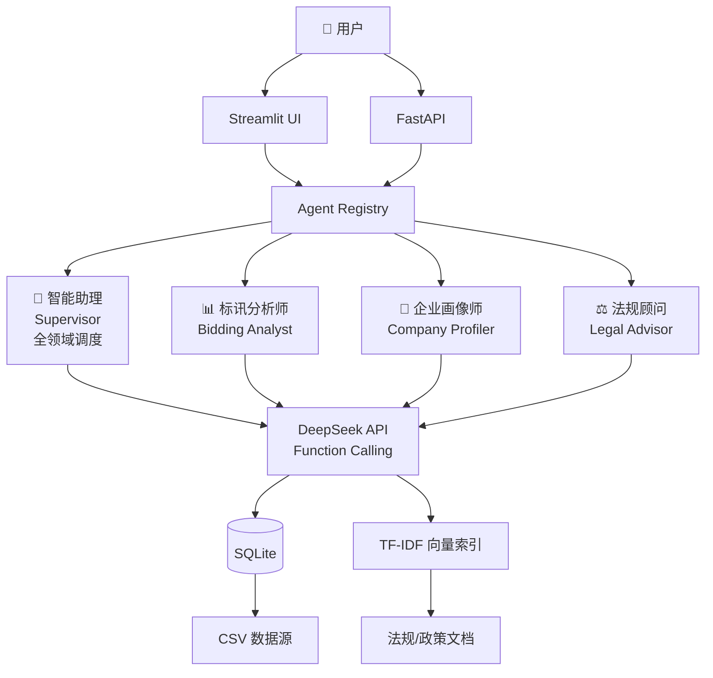

# 📋 招投标智能体平台

> 基于大语言模型的多智能体招投标分析平台 —— Multi-Agent RAG System for Bidding Intelligence

[](https://www.python.org/)
[](LICENSE)
[](https://platform.deepseek.com/)
[](https://streamlit.io/)
[](https://fastapi.tiangolo.com/)

## 项目简介

招投标智能体平台是一个面向招投标场景的 AI 智能分析系统。平台集成**标讯分析**、**企业画像**、**法规咨询**三大核心能力，通过 LLM Agent 自主调用工具完成多维度分析任务，帮助用户从海量招投标数据中快速获取洞察。

## 架构



## 核心特性

- **多智能体协作**：4 个专用 Agent，每个拥有独立的工具集和系统提示词
- **Tool Calling 自主决策**：Agent 自动判断调用哪些工具、传什么参数、何时停止
- **语义检索**：基于 TF-IDF + 余弦相似度的中文法律法规语义搜索
- **企业全景画像**：整合企业信息 + 历史中标记录 + 同行业竞争格局
- **双模式访问**：Streamlit 交互式 UI + FastAPI REST API
- **兼容 OpenAI SDK**：使用标准 OpenAI SDK，可无缝切换兼容模型（DeepSeek / Qwen / GLM 等）

## 快速开始

### 环境要求

- Python 3.11+
- DeepSeek API Key（[申请地址](https://platform.deepseek.com/)）

### 安装

```bash
# 克隆仓库
git clone https://github.com/your-username/bid-agent.git
cd bid-agent

# 创建虚拟环境
python -m venv venv
source venv/bin/activate  # Linux/Mac
# venv\Scripts\activate   # Windows

# 安装依赖
pip install -r requirements.txt
```

### 配置

```bash
# 复制环境变量模板
cp .env.example .env

# 编辑 .env 填入你的 API Key
# DEEPSEEK_API_KEY=your-deepseek-api-key-here
```

### 初始化数据库

```bash
python scripts/init_db.py      # 从 CSV 构建 SQLite 数据库
python scripts/build_index.py  # 构建 TF-IDF 语义索引
```

### 启动

**Streamlit UI：**
```bash
streamlit run app.py
```

**FastAPI API：**
```bash
uvicorn api:app --reload --port 8000
# 打开 http://localhost:8000/docs 查看 Swagger 文档
```

**Docker 一键启动：**
```bash
docker-compose up -d
```

## Agent 说明

| Agent | 角色 | 可用工具 |
|-------|------|---------|
| 🤖 智能助理 (Supervisor) | 跨领域综合分析调度 | 全部 9 个工具 |
| 📊 标讯分析师 (Bidding Analyst) | 招标公告搜索、趋势统计 | search_notices, query_trends, get_notice_detail |
| 🏢 企业画像师 (Company Profiler) | 企业信息查询、竞对分析 | search_companies, get_company_profile, find_competitors |
| ⚖️ 法规顾问 (Legal Advisor) | 法律法规检索、法条查询 | semantic_search_laws, search_laws, get_article |

## 工具列表

| 工具名称 | 功能 | 所属领域 |
|---------|------|---------|
| `search_notices` | 关键词模糊搜索招标公告 | 标讯 |
| `query_trends` | 行业中标金额/数量统计 + Top5 企业 | 标讯 |
| `get_notice_detail` | 公告详情查询 | 标讯 |
| `search_companies` | 按城市/行业/注册资本筛选企业 | 企业 |
| `get_company_profile` | 企业全景画像（信息+中标+同行） | 企业 |
| `find_competitors` | 同地区同行业竞争对手排名 | 企业 |
| `semantic_search_laws` | TF-IDF 语义搜索法规政策 | 法规 |
| `search_laws` | 关键词全文搜索法条 | 法规 |
| `get_article` | 精确查询法条原文 | 法规 |

## 项目结构

```
bid-agent/
├── agent/                  # 智能体核心
│   ├── core.py             # BidAgent 引擎（function calling 循环、重试）
│   ├── factory.py          # Agent 注册工厂 + 预置 Agent 配置
│   ├── supervisor.py       # 跨领域调度 Agent
│   ├── tools_bidding.py    # 标讯工具
│   ├── tools_company.py    # 企业分析工具
│   ├── tools_legal.py      # 法规检索工具
│   └── vector_store.py     # TF-IDF 语义检索引擎
├── scripts/                # 数据脚本
│   ├── init_db.py          # CSV → SQLite 初始化
│   └── build_index.py      # TF-IDF 索引构建
├── tests/                  # 测试
│   ├── test_agent.py       # Agent 核心逻辑测试（Mock API）
│   └── test_tools.py       # 工具函数测试（真实数据库）
├── data/                   # 数据文件
│   ├── *.csv               # 原始 CSV 数据
│   └── vector_index/       # TF-IDF 索引文件
├── app.py                  # Streamlit 前端入口
├── api.py                  # FastAPI 后端入口
├── Dockerfile              # Docker 镜像
├── docker-compose.yml      # 一键部署
├── requirements.txt        # Python 依赖
└── README.md               # 本文件
```

## API 文档

启动 API 后访问 `http://localhost:8000/docs` 查看交互式 Swagger 文档。

**主要端点：**

```bash
# 列出所有 Agent
GET /agents

# 发送消息
POST /chat
{
  "agent_name": "supervisor",
  "message": "合肥建筑行业有哪些中标企业？"
}

# 查看会话历史
GET /sessions/{session_id}
```

## 技术栈

| 组件 | 技术选型 |
|------|---------|
| LLM 引擎 | DeepSeek Chat（兼容 OpenAI SDK） |
| Agent 框架 | 纯 Python 实现，Function Calling 模式 |
| 语义检索 | scikit-learn TF-IDF + 余弦相似度 |
| 数据库 | SQLite（零配置、便携） |
| 前端 | Streamlit |
| API | FastAPI + Pydantic |
| 测试 | pytest |
| 容器化 | Docker + docker-compose |

## 扩展指南

- **切换模型**：修改 `.env` 中的 `DEEPSEEK_BASE_URL` 和 API Key，即可接入任意 OpenAI 兼容模型（Qwen、GLM、Moonshot 等）
- **添加新 Agent**：在 `agent/factory.py` 中注册新的系统提示词和工具组合
- **升级向量检索**：`agent/vector_store.py` 接口预留了嵌入模型替换空间，可将 TF-IDF 替换为 BGE/M3E 等中文语义模型
- **扩展数据源**：将新的 CSV 文件放入 `data/` 目录，运行 `python scripts/init_db.py` 即可自动建表导入

## License

MIT License — 详见 [LICENSE](LICENSE)
